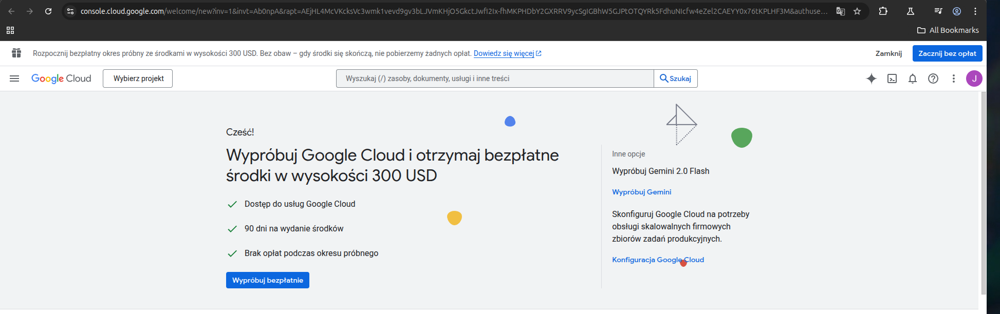

# Kuma Center

This project automates the monitoring using Up-time Kuma and adds restarting of miners. It consists of four main components:

1. **`kuma`**: Up-time Kuma
2. **`config_fetcher`**: Loads miner configuration data from a Google Spreadsheet.
3. **`kuma_updater`**: Moves miners between `active` and `inactive` groups based on spreadsheet data checked against metagraph, it also verifies miner parameters against metagraph, and sends restart signals to the `miner_restarter` service.
4. **`miner_restarter`**: Uses Ansible to restart miner services that fall outside the expected parameters.

## Base necessities

Before spinning up the project, ensure you:

- Fill out the `.env` file with your environment-specific variables.

- Create a Google Service Account with access to the subnet configuration spreadsheet:

To generate an account first create a new project in Google Cloud Console.

Click on "Select project" > "New project" under blockwise organisation

Note down the "identifier" field.

Execute the google_service_account.sh script, paste in the content of the identifier field when asked for "project_id".

Move the generated `credentials.json` to `config_fetcher/`.

Add the newly created service account to the google sheet with config. Give it only read rights.

For default layout you can reference the demo sheet under the link:
https://docs.google.com/spreadsheets/d/1_b1Iw3AaL8ODNi_r6UImbgzOepZN46kkj17QTV-G0p8/edit?usp=sharing

To add new columns and have them reflected in the local files, adjust the mapping in sync_config.py